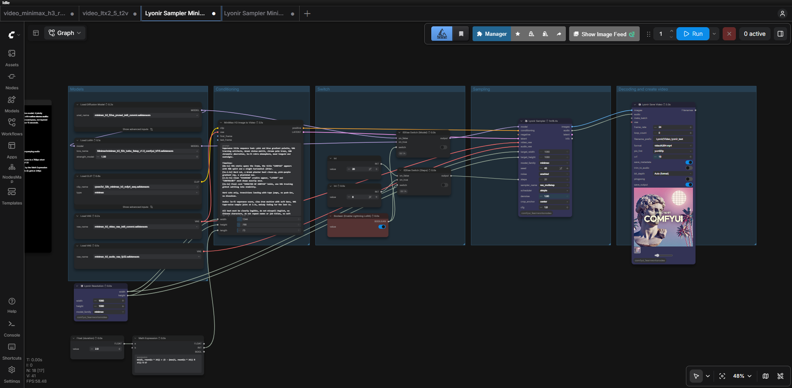
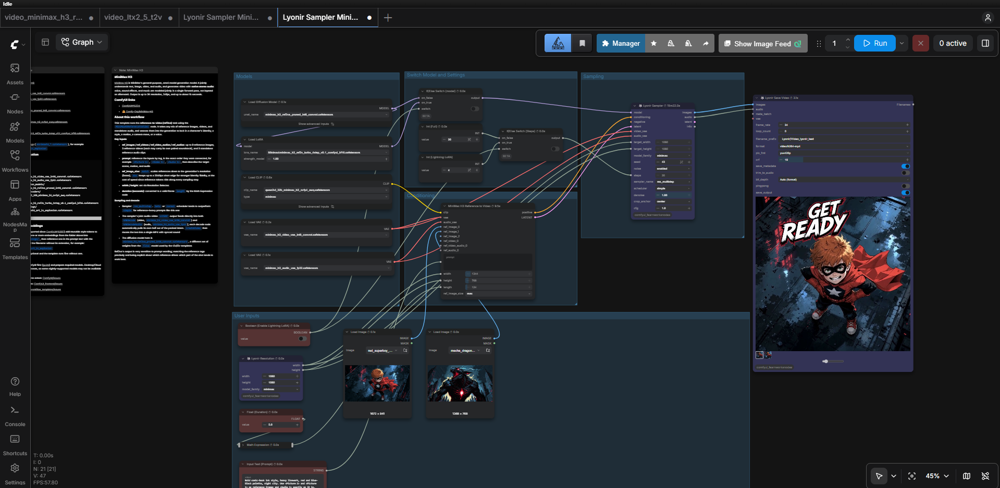
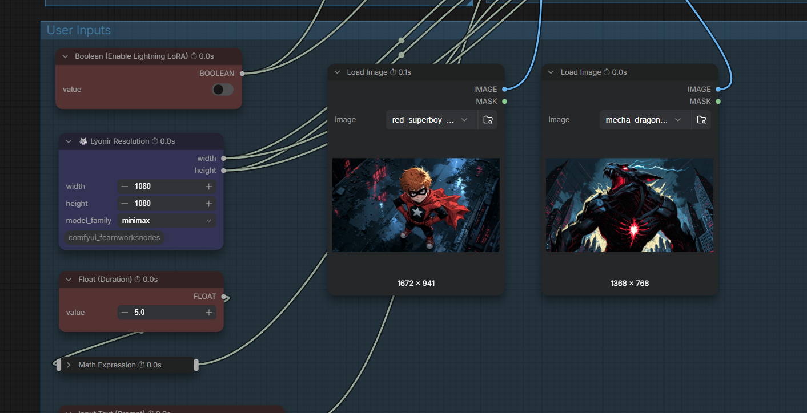
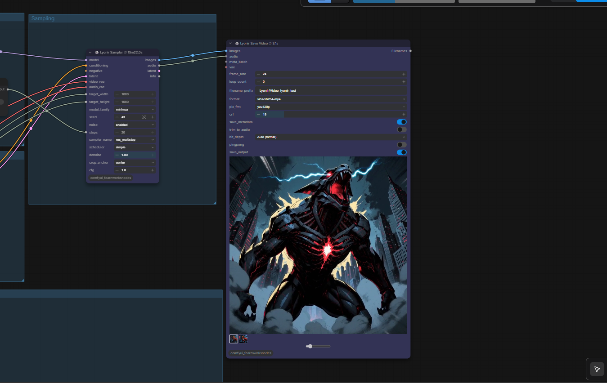
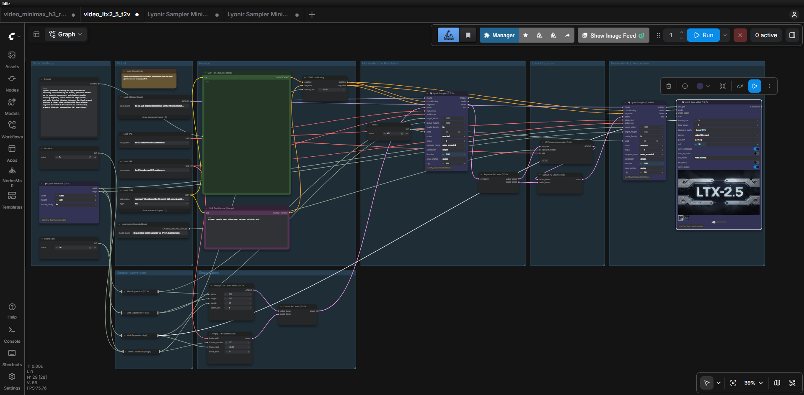
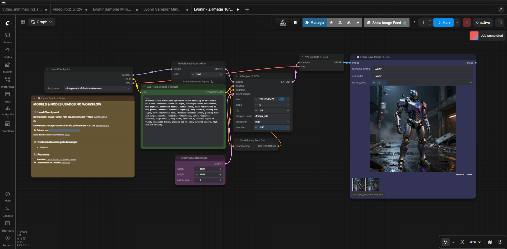

# Example workflows

Download a JSON below and drag it into ComfyUI. These examples use the public Lyonir nodes in v3.5.13 or later. Install the pack requirements and ComfyUI-VideoHelperSuite for video output. Models and reference media are not bundled. Screenshots illustrate the author's local workflows; they are not an automated execution guarantee.

Use ComfyUI Manager to identify missing nodes. Depending on the example, your ComfyUI build must provide MiniMax H3, LTX 2.5, ComfyMathExpression and ComfySwitchNode support. Select equivalent model files available in your own installation.

## MiniMax H3 first/last-frame video

[Download workflow](workflows/Lyonir%20Sampler%20Minimax%20Fl2Va%20Example.json)

Model filenames used in this example:

- `minimax_h3_video_vae_int8_convrot.safetensors`
- `minimax_h3_audio_vae_fp32.safetensors`
- `minimax_h3_fl2va_pruned_int8_convrot.safetensors`
- `qwen3vl_32b_minimax_h3_nvfp4_awq.safetensors`
- `Minimax\minimax_h3_fl2v_turbo_8step_v1.0_comfyui_bf16.safetensors`

Connect your own first/last-frame images to the conditioning node when using image-guided generation.

## MiniMax H3 reference-to-video

[Download workflow](workflows/Lyonir%20Sampler%20Minimax%20Ref2Va%20Example.json)

Model filenames used in this example:

- `minimax_h3_video_vae_int8_convrot.safetensors`
- `minimax_h3_audio_vae_fp32.safetensors`
- `minimax_h3_ref2va_pruned_int8_convrot.safetensors`
- `qwen3vl_32b_minimax_h3_nvfp4_awq.safetensors`
- `Minimax\minimax_h3_ref2v_turbo_4step_v0.1_comfyui_bf16.safetensors`

Replace the two Load Image selections with your own reference images; the named input images are not included.

## LTX 2.5 video with latent upscale

[Download workflow](workflows/Lyonir%20Sampler%20LTX%202-5%20Example.json)

Model filenames used in this example:

- `ltx-2.5-latent-spatial-upscaler-x2-bf16-1.0.safetensors`
- `ltx-2.5-22b-distilled-transformer-comfy-int8-convrot.safetensors`
- `ltx-2.5-video-vae-bf16.safetensors`
- `ltx-2.5-audio-vae-bf16.safetensors`
- `gemma4-12b-with-proj-ltx-2.5-comfy-int8-convrot.safetensors`

## Z-Image Turbo and Lyonir Save Image

[Download workflow](workflows/Lyonir%20-%20Z-Image%20Turbo%20txt2img%20save%20image.json)

Model filenames used in this example:

- `z-image-turbo-fp8-aio.safetensors`

## Running an example

1. Install missing nodes and models, then restart ComfyUI.
2. Drag the downloaded JSON into ComfyUI.
3. Check model selectors, input images, resolution, duration and output filenames.
4. Run the workflow. Model memory requirements depend on your hardware and quantization.
